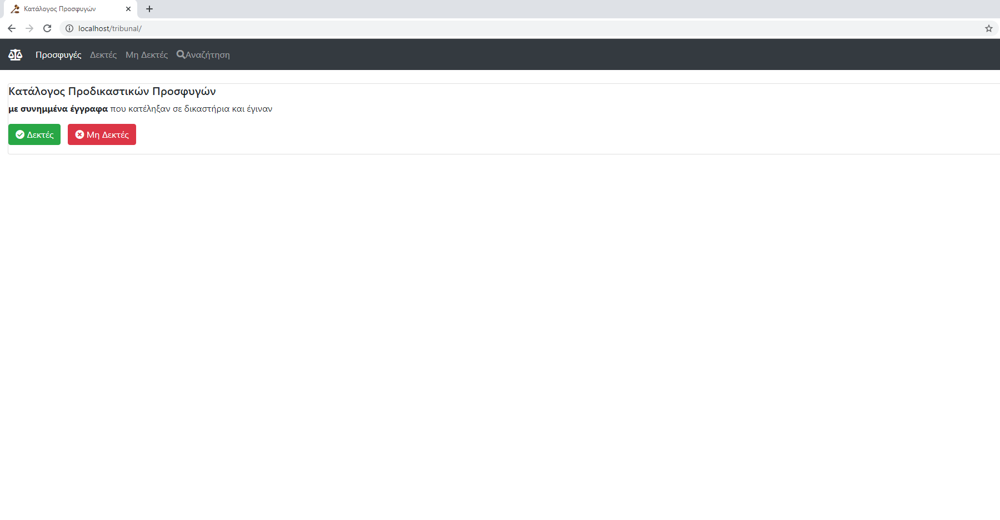
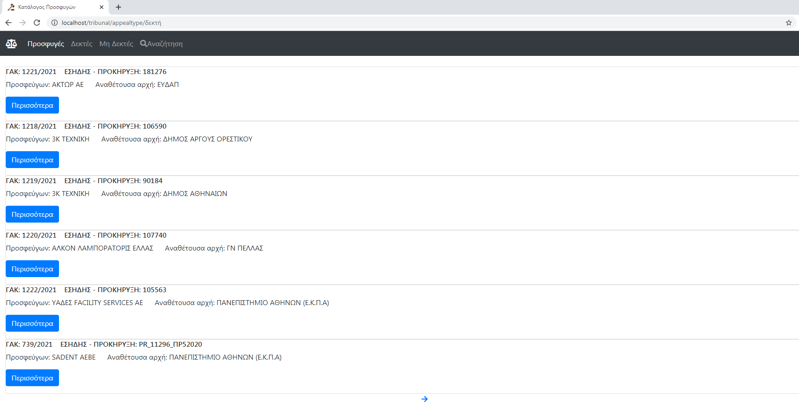
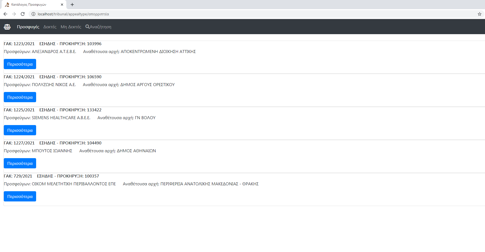
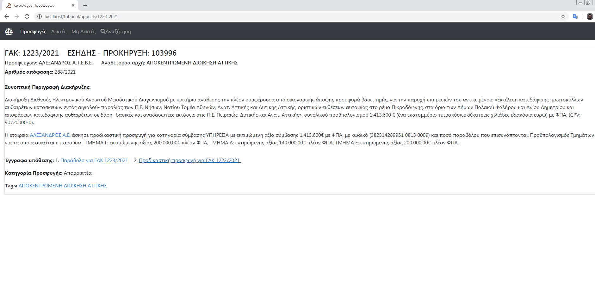
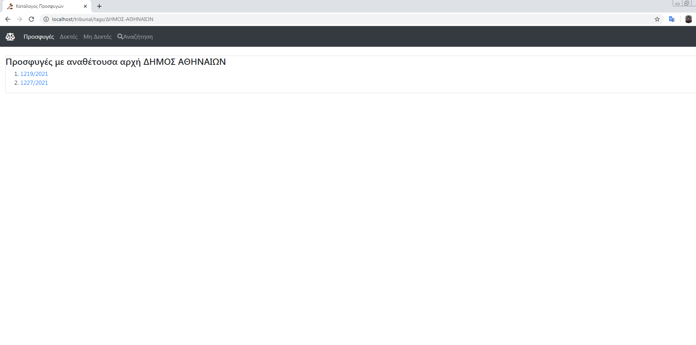
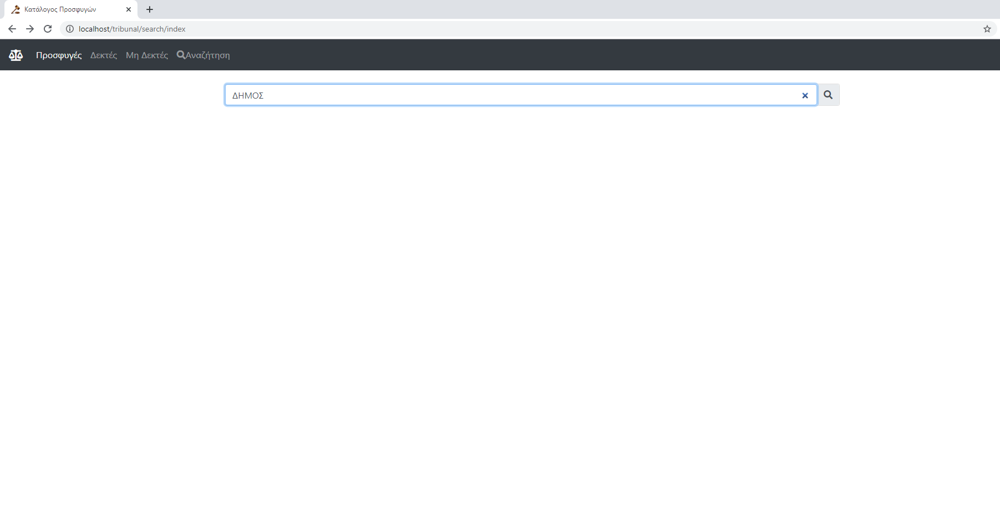
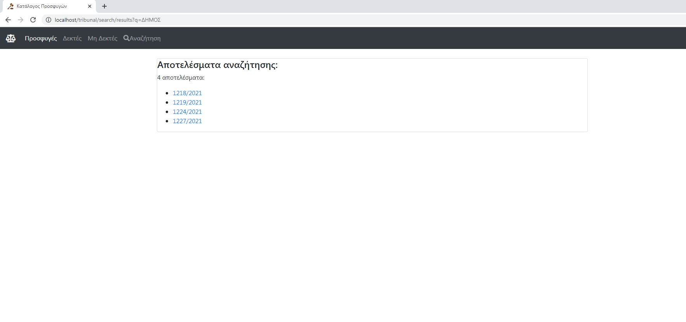

							    Court's Pre-judicial appeals
A Web blog where the user is able to get valuable information about several prejudicial appeals of public procurement organizers regarding court's judgements. Each prejudicial appeal belongs either to accepted or rejected status, as long as the public procurement organizer has submitted all the necessary law documents, where both of them are accessible via specific menus.                                                                                                      
Regarding accepted or rejected status of prejudicial appeal, the user has got the option to acquire additional information for the specific prejudicial appeal such as all the submitted law documents, judgement's ID, synopsis of public procument's task accessible via specific link "more". Furthermore the user has also the ability to view in a blog-listed post specific prejudicial appeals that belong to a definite public procurement organizer via specific tag (taxonomy) link. A search option is added into the menu blog in order to find results for both accepted and rejected prejudicial appeals via specific keywords reagrding filtering of public organizer, appealer or judgment's ID.
This app has been made via [Bootstrap](https://getbootstrap.com/), [font awesome icons](https://fontawesome.com/), [Craft CMS  3.x](https://craftcms.com/) and [MySQL](https://www.mysql.com/).

**General view**

**Category view** *(accepted - rejected status)*

**Specific view**

**Taxonomy view**

**Search view**

